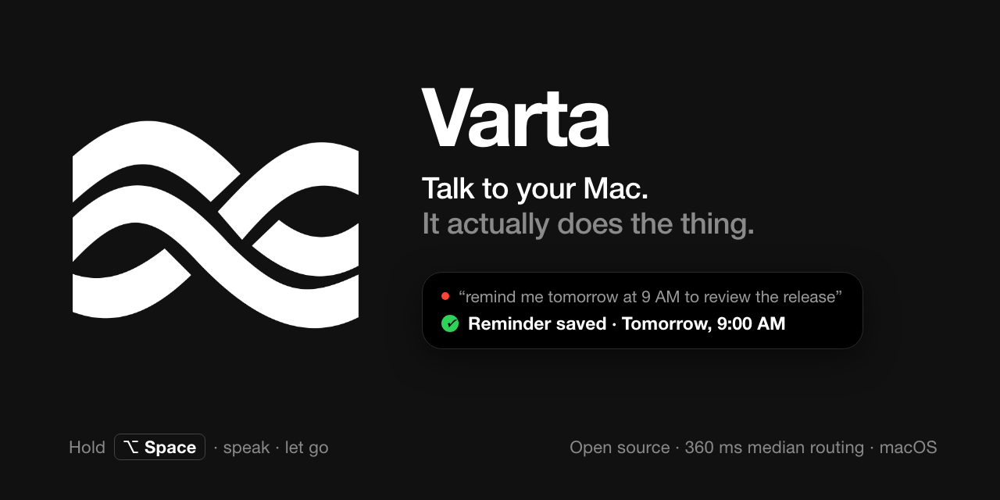
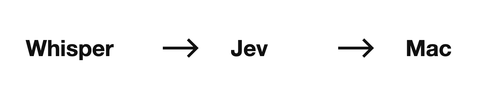

<div align="center">



# Varta

### Talk to your Mac. It actually does the thing.

**Hold ⌥Space · say it · let go.** Notes, reminders, calendar events, tabs, music, files — done
from the notch, with [360 ms median routing](#performance).

[](LICENSE)
[](#requirements)
[](#requirements)
[](app/Package.swift)
[](https://github.com/usekopai/varta/releases/latest)

**[⬇ Download for Mac](https://github.com/usekopai/varta/releases/latest)** · [What you can say](#what-you-can-say) · [How it works](#how-it-works) · [Contribute](CONTRIBUTING.md)

</div>

> 🎙️ “remind me tomorrow at 9 AM to review the release” → ✅ saved to Reminders, alarm set, read back to confirm.

- **Your voice never leaves your Mac.** Whisper runs on-device on the Neural Engine via WhisperKit.
- **It acts, it doesn't just chat.** Native APIs and AppleScript create the note, open the tab, pause the song.
- **It checks its own work.** Varta reads back what happened and tells you when something doesn't match.
- **It won't guess.** Low-confidence requests get a clarifying question instead of a wrong action.

Varta is an **experimental alpha** by Kopai, MIT-licensed, for Apple silicon Macs. Routing uses
[Jev](https://docs.typesafe.ai), so you'll need a TypeSafe API key (provider usage charges apply).
Microphone audio stays local; the command text is sent to Jev.

## What you can say

| Say | Varta will… |
|---|---|
| “create a note called Launch Ideas” | Create a note in Apple Notes |
| “remind me tomorrow at 9 AM to review the release” | Save a reminder with a due time and alarm |
| “schedule a launch review tomorrow at 3 PM for 30 minutes” | Create a Calendar event |
| “open chrome and go to hacker news” | Open Hacker News in Chrome |
| “pause Spotify” / “resume Apple Music” | Control the named music player |
| “open Downloads” | Open your Downloads folder |

We also support Chrome and Safari tab controls, web searches, system volume, local file searches,
app launching, appending to simple notes and daily calendar agendas.

Explore the **[full command guide](docs/COMMANDS.md)** for examples, permissions, clarification
replies and integration limits. Supported examples describe intended behavior; recognition and
routing can still be wrong. Varta can decline uncertain requests. Arbitrary multi-step desktop
tasks are not supported.

## Install

### Download the app

Look for **`Varta-VERSION-arm64.dmg`** on [GitHub Releases](https://github.com/usekopai/varta/releases).
Prebuilt downloads do not require Swift or Xcode. If no DMG has been published yet, use the
source-build instructions below.

1. Open the DMG, drag **Varta** into **Applications**, and eject the disk image.
2. Open Varta from Applications. Our alpha downloads are **ad-hoc signed, not Developer ID
   signed or notarized by Apple**. If macOS blocks the app and you trust the download, use
   **System Settings → Privacy & Security → Open Anyway** for Varta. Managed Macs may restrict this.
3. Complete Setup as described below. The initial speech-model download is approximately 1.5 GB.

See [download verification and first-launch instructions](docs/INSTALLATION.md#download-the-app)
and [Apple’s guidance](https://support.apple.com/102445).

### Build from source

```bash
xcode-select --install
git clone https://github.com/usekopai/varta.git
cd varta
./run.sh
```

The installer builds Varta, signs it locally, installs it to `~/Applications`, and opens it.
The first build and speech-model preparation can take several minutes.

### First launch

In Setup:

1. Allow Microphone and Accessibility access.
2. Paste your Jev API key and save it to your login Keychain.
3. Wait for Speech to show **Ready**.

Hold **⌥Space**, speak, and release. You can also tap once to record and again to submit.
Change the shortcut in Setup if it conflicts with another app. **Esc cancels pending work**;
it cannot undo actions already dispatched to macOS. Additional integrations request their own
macOS permissions on first use.

See [Installation](docs/INSTALLATION.md) for key setup, permissions, local signing, updates
and removal. macOS may require permission reapproval after an update or signing change.

### Requirements

| Requirement | Details |
|---|---|
| Mac | Apple silicon (M1 or later), macOS 15+ |
| Build tools (source builds only) | Swift 6.0+ and macOS SDK 15+; compatible Xcode Command Line Tools are sufficient |
| API access | A TypeSafe key for Jev; provider usage charges apply |
| Disk space | Approximately 1.5 GB for the default speech model, plus compiled model data; source builds also need build dependencies |
| Network | Initial downloads and Jev routing/result checks require internet access |
| Integrations | Chrome/Safari, Spotify/Apple Music and Apple productivity apps, depending on the command |

## How it works



1. **Transcribe locally.** [WhisperKit](https://github.com/argmaxinc/WhisperKit) runs Whisper
   through Core ML while you speak.
2. **Choose a structured action.** [Jev](https://docs.typesafe.ai) selects an intent and
   arguments from candidates built from your transcript, installed apps and known websites.
3. **Execute directly.** Native APIs, AppleScript and supported accessibility menu commands
   carry out the action. Vision-based computer use is disabled.
4. **Check supported outcomes.** We read back supported results and report mismatches or
   uncertainty. Some commands confirm dispatch only; they do not independently verify visible completion.

Read the [architecture guide](docs/ARCHITECTURE.md) for the pipeline and extension points.

## Privacy

- **Audio stays local.** We do not send microphone audio to Jev.
- **Command text and routing context go to Jev.** Context can include shortlisted app names
  and website titles/URLs from Chrome bookmarks and top sites.
- **Some checks send metadata.** Supported menu/control labels, Spotify track details or a
  Chrome page title and URL may be sent alongside your command.
- **No operator analytics or crash reporting.** Local logs can contain transcripts, plans,
  URLs and results. Review them before sharing.
- **No screenshots in the enabled pipeline.** Download hosts and the websites, browsers and
  music services you use receive the requests needed for their functions.

See [Security and privacy](SECURITY.md) for data handling and execution boundaries, and
[Installation](docs/INSTALLATION.md) for deleting credentials and local data.

## Performance

We measure routing separately from complete command latency. In our 15-request routing
benchmark on an M4 Pro, the expected plan was selected for every request, with **360 ms median
routing time** and **674 ms p95**.

In a separate prepared synthetic workload, folder dispatch took **722 ms median** across five
attempts. Historical microphone commands reporting success took about **2.28 seconds median**
to final status across 21 samples from pre-release builds. App-opening trials also exposed
foreground-verification mismatches. These measurements have different completion boundaries;
they do not establish universal sub-second completion or a comparative speed ranking.

Our [performance guide](docs/PERFORMANCE.md) and [speech-to-status report](docs/LATENCY-2026-10-04.md)
include methodology, unsuccessful attempts, raw samples and reproduction commands.
[Router evaluation](eval/README.md) documents the 114-command recorded dataset and its limits.

## Documentation

| Guide | Purpose |
|---|---|
| [Commands](docs/COMMANDS.md) | Supported requests, permissions and integration limits |
| [Installation](docs/INSTALLATION.md) | Setup, configuration, troubleshooting, updates and removal |
| [Architecture](docs/ARCHITECTURE.md) | How speech becomes a plan and an action |
| [Swift package](app/README.md) | App, engine and CLI targets |
| [Evaluation](eval/README.md) | Labelled commands and recorded router tests |
| [Testing](docs/TESTING.md) | Automated and manual contributor checks |
| [Performance](docs/PERFORMANCE.md) | Measurements and benchmarking |
| [Releasing](docs/RELEASING.md) | Maintainer distribution procedure |

## Contributing

We welcome improvements to supported commands, recognition, reliability and documentation.
Adding a website, app alias or labelled command is a useful first contribution.
Read [CONTRIBUTING.md](CONTRIBUTING.md) to get started.

## Credits


- [Jev](https://docs.typesafe.ai) by TypeSafe — structured decision model.
- [WhisperKit](https://github.com/argmaxinc/WhisperKit) by Argmax — local Whisper through Core ML.
- Related projects: [jev-voice](https://github.com/kevinbadi/jev-voice),
  [UI-TARS](https://github.com/bytedance/ui-tars), and [ShowUI](https://github.com/showlab/showui).

## License

[MIT](LICENSE) © Kopai
